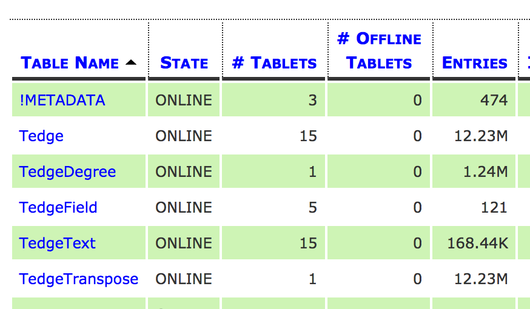
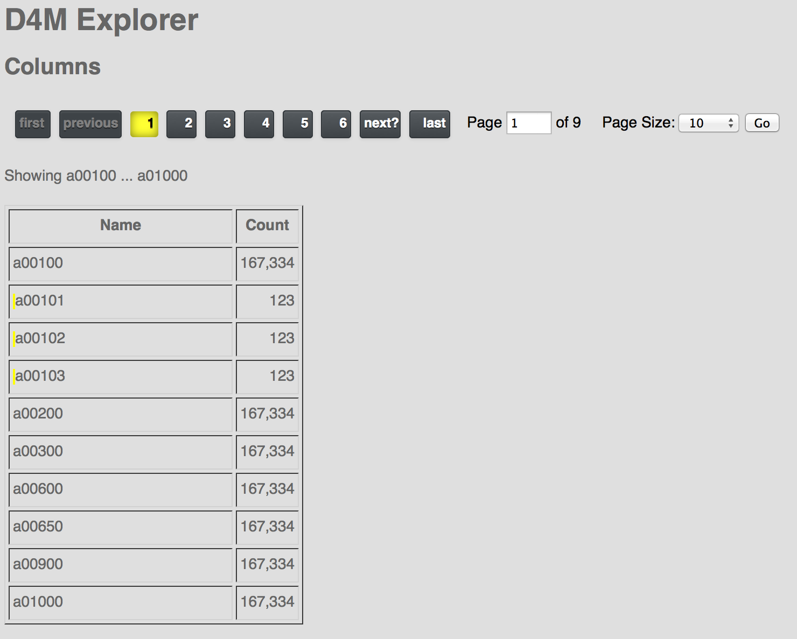

Getting Started
---------------

How to get started? First, get D4M working. There are instructions how to create a 
three-node Accumulo cluster and how to install D4M at 
https://github.com/medined/Accumulo_1_5_0_By_Vagrant. 

To summarize, run the following two commands then follow the on-screen 
instructions to start Accumulo.

```
vagrant up
./post_spinup.sh
```

Now go into your clone of the D4M_Schema project. Open in NetBeans. Select
the schema module. Then run the "CreateTablesAndLoadData" program. Below
is an image showing the D4M tables in Accumulo.



The next step starts the _Data Explorer_ web application. From a command line,
connect to the project directory. Then do the following:

```
cd explorer
./start_server.sh
```

http://localhost:8080/home should now be responsive. Below is an example of the
home page:


