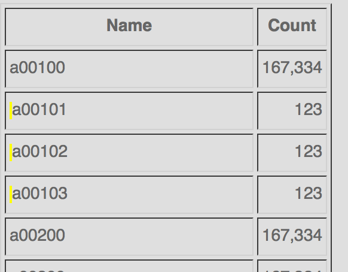

# Pagination in Accumulo

Pagination in Accumulo is not simple. Pages are not deterministic since the 
data can be constantly changing. Also authorization levels can change the 
number of returned results. Another consideration is that Accumulo tables 
can only be scanned forwards and not backwards. With these factors in 
mind, I am implementing the following technique. I hope the community 
can point out flaws and provide improvements.

>Iterators can only scan forward, not backward!

After a couple of conversions, it's obvious there are severals approaches to
this issue. And in general, I can't see any technical reason to favor one 
over another. The information under consideration is a slowly changing
dimension (SCD). That was an important factor for me.

>Does your information change quickly?

While the pages are not deterministic, we can still pre-compute them to 
provide a best-guess and have some semblance of a normal page interaction:

There is an obvious problem with this technique. What if 100 rows were added 
between pages one and two but the page size was 50? Some of the records 
would never be displayed or discoverable.

>Never let users miss data!

Before suggesting a refinement to address this issue, let me talk about the 
pagination pre-computation using the TedgeField (from my extension to D4M) 
as an example:

    scanner = connector.createScanner(tableName, new Authorizations());
    Iterator<Map.Entry<Key, Value>> iterator = scanner.iterator();
    while (iterator.hasNext()) {
        Entry<Key, Value> entry = iterator.next();
        String fieldName = entry.getKey().getRow();
        if (entryCount == 0 || (entryCount % pageSize == 0)) {
            System.out.println(String.format("%d,%s", pageNumber, fieldName));
            pageNumber++;
        }
        entryCount++;
    }

The TedgeField table looks like this:

   ROW          * CQ      * VALUE
 ---------------------------------
   STATE_NAME   * field   * 1
   CITY_NAME    * field   * 1    

After the pre-compute is run, you might see:

1,a00100
2,a02500
3,a10300
4,a59660
5,n01400
6,n07220
7,n18450
8,state

When the user clicks a page number (let's say 3, an appropriate scanner is 
initialized.

        scan.setBatchSize(batchSize);
        scan.setRange(new Range(new Text("a10300", true, null, true);

For a page size of 5 you might see the following:

a10300_01
a10300_02
a10300_03
a10300_04
a10300_05

This looks just fine. But notice that page 4 starts with a59660. And there 
could be a lots of entries between a10300_05 and a59660 that were added 
since the last pre-computation of pagination. So I am changing the page
interaction elements to be:

The change is very subtle. Just the addition of the question mark (?) at the
end of the next button. That is the signal to the user that clicking next
will show the next _PageSize_ items instead of the next page.

In other words, the new meaning of _next_ is to step through every entry. Pages 
become elastic - you only get to the next page number when the top row of the 
page (as determined by precomputing) is passed. In contrast, the Previous 
function remains the same. You jump immediately to the row associated with 
the page or to the next row visible to you.

The timestamp of the search results can be compared to the timestamp of the
pre-computed page breaks so that a 'NEW SINCE PRE-COMPUTE' indicator can be 
added to the search results. Below is an subtle example how to indicate
newly-added records.

## Alternative Approaches

> I am not attributing these approaches because the originators have not had
> a chance to edit them. However, if anyone wants to claim authorship, I'm
> happy to comply.

### Approach A

Assuming you are showing 10
entries per page, and 5 new keys get added to page 2, after you've
navigated to page 3 (or later), and then you navigate back to page 2,
you could do one of these two things:

Strategy 1. Keep the existing page markers for the later pages, and
show all 15 entries on page 2 now. This strategy could be problematic
if many new entries are inserted.

Strategy 2. Reset all page markers after the current page, whenever
you navigate back. This strategy requires navigating sequentially
again... no jumping forward, even if you've navigated there before.

You could also do some sort of hybrid approach: use strategy 1 unless
there are too many new entries (some % threshold beyond the configured
entries per page; maybe 10-20%), and then fall back to strategy 2 and
reset future page markers if that threshold is exceeded.

### Approach B

It's reasonable that the results the user sees is from the time of the 
query, rather than dealing dynamically with newly introduced data.  Of 
course, that's highly problematic when your iterator can't go backwards.

Someone fielded the suggestion of taking the key of the top result, and 
that is certainly the solution I was leaning for, although I fear the edge 
case is that data can also be deleted -- and what if it were your key.

I don't know how practical it is, but could you conceivably emit a key 
list to another temporary namespace? Some clever lazy loading might be 
in order:

Grab your iterator and traverse over the first 10 pages or so, emitting a 
set of ordered keys to another namespace, and then hold.

Then within that temporary namespace, grab another iterator to let the user 
browse the pages.  If the user backs up, then restart, or even use the 
top-of-the-page result (as now you know they aren't going away or changing 
counts).  If the user wants to walk off the "cached" pages, use the retrieval 
iterator to grab the next batch of 10 pages, adding it to the temporary 
name space.

The trade-offs for paging in this manner are increased complexity, more 
 (vs time and change), and cleanup.  The upside is most people find what 
they need in the first few items.  The downside is when the user goes to r
etrieve the actual data, it may be gone (stale index -- although that could 
be true at any given microsecond: search, delete, click).

### Approach C

From any page, the user can move to the next page, but can't skip pages when 
moving forward.  As the user pages forward, you store the first key of each 
page.  This allows the user to jump back to any earlier page.  When returning 
to the first page you have to make a decision about how to let the user 
retrieve new data that might have been added before the original first page 
of data.

The interaction ends up being a bit like gmail paging ... you can go forward 
or back one page, and you can jump back to the first page, but no other jumps 
are allowed.  Gmail paginates on the fly, however -- if you're on page 50 
of your inbox and you receive a new message, all the messages on that page 
will move down one.  With the scheme above, the first key of each page will 
be fixed until you return to the beginning and start paging forward again.  
However, you may see new keys inserted in the middle of pages, unless you 
intentionally filter those out.
